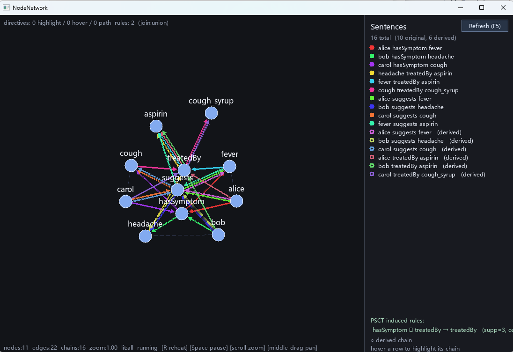

# NodeNetwork

A small interactive **force-directed graph viewer** written in C++ with SDL2,
and the reference implementation for **Path-Space Cognition Theory (PSCT)** —
a framework in which deduction, analogy, and induction are unified as path-search
operations and arranged into a self-driven closed loop.

Edges are directed and rendered with arrowheads that land on the target
node's border.



---

## Paper

This repository accompanies:

> **Path-Space Cognition Theory: Self-Sourced Analogy and a Closed Loop for Deduction, Analogy, and Induction.**
> Ng Cheng How. 2026. (arXiv preprint — link forthcoming.)

If you use this code or the framework, please cite:

```bibtex
@article{ng2026psct,
  title   = {Path-Space Cognition Theory: Self-Sourced Analogy and a Closed Loop for Deduction, Analogy, and Induction},
  author  = {Ng, Cheng How},
  year    = {2026},
  journal = {arXiv preprint},
  note    = {arXiv link forthcoming}
}
```

The paper introduces a single construction — **self-sourced analogy**: the
partial path traversed before a deductive dead-end is used directly as the
structural query for analogical search. From this construction, three
classical reasoning modes (deduction, analogy, induction) collapse into
differently parameterised forms of path search on the same directed labeled
graph, and form a closed loop in which each mode's output or failure provides
the trigger for the next. See the paper's §4.1 for the formal mechanism and
§A.10 for an end-to-end trace.

---

## Graph syntax

Every token on a line is a node. Consecutive tokens become an edge, so
**relationships are first-class nodes** — `bird->color->red` produces three
nodes (`bird`, `color`, `red`) connected as `bird → color → red`. Repeating
the same token (e.g. `color` in multiple lines) merges into a single hub node.

| form                | meaning                              |
| ------------------- | ------------------------------------ |
| `a->b`              | edge from `a` to `b`                 |
| `a->p->b`           | three nodes connected as `a → p → b` |
| `a->b->c->d`        | chain of edges `a → b → c → d`       |
| `# ...` or `// ...` | comment                              |

Example:

```
bird->color->red
bird->color->black
bird->name->crow
crow->eats->seeds
```

Here `color`, `name`, and `eats` each become their own node, which lets
relationship nodes attract their participants and act as visible hubs in
the layout.

---

## PSCT closed loop (`psct:enable`)

Implements *Path-Space Cognition Theory* (Ng, 2026) on top of the existing
rule engine. The core mechanism is **self-sourced analogy**: when goal-directed
deduction fails mid-traversal, the partial path it has already walked is used
as the structural query for analogical search. This eliminates the
source-of-source problem that structure-mapping theory leaves to external input,
and is the mechanism that closes the deduction → analogy → induction loop
without an external controller.

### Implementation mapping

The implementation in [`src/main.cpp`](src/main.cpp) mirrors the paper's
primitives:

| paper §                            | function / field in `src/main.cpp`                                           |
| ---------------------------------- | ---------------------------------------------------------------------------- |
| §2.2 G\_full / C separation        | `Graph::gfullChains`, `Graph::chainConfidence`                               |
| §3.1 DEDUCE (goal-directed BFS)    | `psctDeduce`, returns `DeduceResult` with `partialLabels` Σ on FAIL          |
| §4.1 self-sourced analogy          | Σ becomes the query for `psctFindAnalogs`                                    |
| §4.3 Step 2 analog search          | `psctFindAnalogs(g, labelSeq)`                                               |
| §4.3 Step 3 κ-bounded reachability | `psctNodeDistance(g, t, u_m)` with κ = m                                     |
| §4.3 confidence                    | `psctConfidence(supp, cex, dist) = (supp/(supp+cex)) × 1/(1+dist)`           |
| §5.3 Definition 5.2                | `weightedSupportByPattern` + `cexByPattern`; ratio `\|Cex\| / \|Ant\|`        |
| §5.3 weighted support              | instance weight = `min(conf(C₁), conf(C₂))`                                  |
| §5.4 folding                       | rule synthesis inside `runPSCTLoop`                                          |
| §6.1 Construction 6.1              | `runPSCTLoop` (goal-directed → scan-mode → induction → re-deduce)            |

Activate with `psct:` directives at the top of a graph file:

```
psct:enable
psct:theta=3
psct:epsilon=0.0
```

Optional goal-directed parameters (enable the §4 mechanism end-to-end —
see [Goal-directed demo](#goal-directed-demo-psct_demo3) below):

```
psct:start=<node-id>
psct:goal=<node-id>
```

After the normal deduction fixpoint runs, the viewer:

1. **Analogy step.** Enumerates every chain composition `X→λ₁→Y` ∘
   `Y→λ₂→Z` currently in the contextual network. The pair `(λ₁, λ₂)` is the
   path's edge-label sequence — PSCT's structural fingerprint. (When `psct:start` and `psct:goal` are set, this is preceded by a goal-directed
   `psctDeduce`; on failure, the partial label sequence Σ becomes the analog
   search template — *self-sourced analogy*.)
2. **Induction step.** For each `(λ₁, λ₂)` with support `|Supp| ≥ θ` and
   counter-example rate `|Cex| / |Ant| ≤ ε` (where `|Ant| = |Supp| + |Cex|`
   is the antecedent-instance count per paper §5.3 Definition 5.2),
   synthesises the rule `IF X→λ₁→Y AND Y→λ₂→Z THEN X→λ₂→Z` and appends it to
   the rule set with `induced=true`. Counter-examples are `(X, Y)` pairs
   where `X→λ₁→Y` exists but `Y` has no outgoing `λ₂` edge — the antecedent
   can't chain.
3. **Re-deduce.** Calls `evaluateRules` again so the newly-induced rule
   fires and extends the contextual network. The loop repeats until no new
   rule is added (or 8 iterations as a safety cap).

### Scan-mode demo

The demo graph in `assets/graph.txt` ships with **zero hand-written rules**.
With `psct:enable, θ=3, ε=0` the engine reproduces the man / bird / john
closed loop end-to-end:

```
PSCT: closed loop start: 6 chains, θ=3, ε=0.00
PSCT: iter 1 analogy: 2 distinct (λ₁,λ₂) patterns
PSCT:   (isa, will) supp=3 cex=0 ratio=0.00
PSCT:   ↳ induced rule: IF X->isa->Y AND Y->will->Z THEN X->will->Z
PSCT:   (isa, isa) supp=1 cex=2 ratio=2.00
PSCT: iter 1 deduction with induced rules: +4 chains
PSCT: iter 2: no new rules — loop terminates
```

Read top-down: deduction with the empty rule set derives nothing → analogy
finds three `(isa, will)` compositions and one `(isa, isa)` → `(isa, will)`
clears the θ/ε threshold so the transitivity rule is induced → re-running
deduction with that rule produces four new chains (`john will talk`, `man will die`, `bird will die`, `john will die`). The induced rule and its
statistics appear at the bottom of the right sidebar; the newly-derived
sentences appear in the chain list, each in its own chain color.

This demo exercises §5–§6 of the paper. It does **not** exercise §4.3's
non-trivial mechanisms (non-empty source template Σ, κ-bounded reachability
filter, confidence < 1.0) because the empty rule set causes `psctDeduce` to
fail at the start node, leaving Σ empty and falling through to scan mode.
For a demo that exercises §4.3 end-to-end, see below.

### Goal-directed demo: `psct_demo3`

The demo in [`assets/psct_demo3.txt`](assets/psct_demo3.txt) is the
paper's §A.10 worked example. It is the **only** demo that exercises every
component of §4.3:

- a **non-empty source template** Σ generated by goal-directed deductive failure (§4.1);
- a **label-constrained isomorphic search** with a real template (§4.3 Step 2);
- a **κ-bounded reachability filter** that non-trivially eliminates one of three analogs (§4.3 Step 3);
- a **confidence formula evaluated at dist > 0**, yielding conf = 0.50;
- a **full revolution of Construction 6.1** — the §4 prediction triggers a §5 induction, which folds a new transitive-treatment rule, which the next §3 deduction pass uses to derive six more chains before the loop reaches fixpoint.

Run it:

```bash
./build/NodeNetwork assets/psct_demo3.txt
```

Expected `PSCT:` trace (verbatim; see paper §A.10.2 for the full annotated
walkthrough):

```
PSCT: closed loop start: 9 chains, θ=2, ε=0.00 (goal=aspirin)
PSCT: §3 DEDUCE FAIL at fever after 1 hop(s) — fingerprint Σ=(suggests)
PSCT:   analog #1: alice -> fever
PSCT:   analog #2: bob -> headache
PSCT:   analog #3: carol -> cough
PSCT: §4 analogy: 3 analogs, 0 prefix-only (cex), κ=1
PSCT:   κ-check: dist_G(aspirin, fever) = 1 ≤ κ=1 — pass
PSCT:   conf = (|Supp|/(|Supp|+|Cex|)) × (1/(1+dist)) = (3/(3+0)) × (1/(1+1)) = 1.00 × 0.50 = 0.50
PSCT:   ↳ predict fever -suggests-> aspirin  (conf=0.50, dist=1, κ=1)
PSCT:   κ-check: dist_G(aspirin, headache) = 1 ≤ κ=1 — pass
PSCT:   κ-check: terminal cough unreachable from goal aspirin — skip
PSCT: iter 1 §5 weighted analogy: 4 distinct (λ₁,λ₂) patterns
PSCT:   (hasSymptom, treatedBy) wSupp=3.00 rawSupp=3 cex=0 ratio=0.00
PSCT:   ↳ induced rule: IF X->hasSymptom->Y AND Y->treatedBy->Z THEN X->treatedBy->Z
PSCT:   ... (further patterns elided — see paper §A.10.2)
PSCT: iter 1 deduction with induced rules: +6 chains
PSCT: iter 2: no new rules — loop terminates
PSCT: closed loop done: 16 chains, 2 rules
```

The four `psctTrace` lines added to `runPSCTLoop` for this demo (analog
listing, κ-check decisions, confidence breakdown, "no analog survived"
sentinel) make the §4.3 mechanism visible at runtime; they do not change
the algorithm. See paper §B.11 for a line-by-line correspondence between
the trace and the implementation.

---

## Rules (`IF ... THEN ...`)

A graph file may also contain **inference rules**. The viewer evaluates them
to a fixpoint after parsing and renders the **derived edges in green** so
new facts are visually distinct.

```
IF
A->will->B AND C->isa->A
THEN
C->will->B
```

Syntax:

- A block starts on a line containing only `IF` (case-insensitive).
- Body lines list triple patterns of the form `s->p->o`, joined with `AND` (whole-word, case-insensitive). You can write all patterns on one line, or
  split them across multiple lines.
- A line containing only `THEN` switches to the consequent.
- The consequent is one or more triple patterns. A **blank line ends the
  rule**.
- In a pattern, a token whose first character is an ASCII uppercase letter
  (`A`, `Bird`, `X1`) is a **variable**. Everything else is a **constant** (matches a literal node id, creating it for the consequent if needed).
- Variables are shared across the antecedent patterns: the rule fires for
  every assignment that satisfies all of them.

Each successful firing produces a chain `s -> p -> o` (so hover BFS sees it
like any other chain) and marks both edges as derived. Both edges of a
derived chain render green — even if one of them already existed in the
graph — so the whole rule output stands out.

**Matching is chain-bounded.** A pattern triple matches only when `(s, p, o)` appears as a consecutive 3-window inside some chain — either an
original source line or a chain produced by a previous rule firing. A 2-hop
path that happens to exist in the directed graph but spans two unrelated
chains at a shared hub node does *not* count, so the rule won't invent
sentences like `bird will talk` from `bird->will->fly` plus `man->will->talk` just because both touch `will`.

Evaluation iterates until no new edge is added, capped at 16 rounds.

---

## Highlight directives

A graph file may contain directives that **light up part of the graph by
default**. Anything not lit is dimmed. Each directive is one line, mixed in
with the chain lines. Mouse hover always wins over the directive-driven
default.

| directive                                   | effect                                                                                                     |
| ------------------------------------------- | ---------------------------------------------------------------------------------------------------------- |
| `highlight:a[,b,...]`                       | light each listed node + every chain (source line) it appears in                                           |
| `hover:a[,b,...]`                           | chain-head BFS from each listed node, lighting every chain reachable by following arrows out of head nodes |
| `path:from->to`                             | light the shortest path between two nodes                                                                  |
| `path:from->to,show:shortest`               | same — union every tied-for-shortest path (default)                                                        |
| `path:from->to,shortest:one`                | pick a single shortest path                                                                                |
| `path:from->to,show:all`                    | union every simple (no repeated node) path, capped at 500                                                  |
| `path:from->to,search:node`                 | path search treats any shared node as a link (default)                                                     |
| `path:from->to,search:edge`                 | only link chains at their head/tail nodes; from/to must themselves be head/tail of some chain              |
| `path:from->to,includes:x[,includes:y,...]` | constrain the path to pass through each listed intermediate, in order                                      |
| `join:union` / `join:intersect`             | combine multiple directives by union (default) or intersection                                             |

Example ([assets/example_directives.txt](assets/example_directives.txt)):

```
path:fly->animal,show:shortest,search:edge
highlight:crow
hover:john

man->will->talk
bird->will->fly
john->isa->man
man->isa->animal
bird->isa->animal
animal->will->die
```

Run it with:

```bash
./build/NodeNetwork assets/example_directives.txt
```

`hover:john` lights `john`, then transitively `isa`, `man`, `animal`, `will`, `talk`, `die`, plus the corresponding edges. `highlight:crow` adds
nothing here because `crow` isn't in the graph. `path:fly->animal` in `search:edge` mode lights the shortest chain-link path from `fly` back
through `bird` and out to `animal`. All three directive sets are unioned
(default `join:union`).

---

## Controls

| input                                  | action                                                                                    |
| -------------------------------------- | ----------------------------------------------------------------------------------------- |
| left-drag a node                       | pin and move it (release to unpin)                                                        |
| mouse hover a node                     | transient highlight: chain-head BFS from that node (overrides directive default)          |
| mouse hover a sentence (right sidebar) | highlight only that chain in the graph                                                    |
| **Refresh** button / `F5`              | re-read the graph file from disk and rebuild (positions of surviving nodes are preserved) |
| middle-drag / right-drag               | pan                                                                                       |
| mouse wheel                            | zoom                                                                                      |
| `R`                                    | reheat — randomize positions                                                              |
| `Space`                                | pause / resume simulation                                                                 |
| `Esc` / close window                   | quit                                                                                      |

---

## Building

Requires **CMake ≥ 3.16**, a C++17 compiler, and **SDL2** + **SDL2_ttf**
development packages.

### Windows (MSYS2 / MinGW)

```bash
pacman -S mingw-w64-x86_64-toolchain mingw-w64-x86_64-cmake \
          mingw-w64-x86_64-SDL2 mingw-w64-x86_64-SDL2_ttf

cmake -S . -B build -G "MinGW Makefiles"
cmake --build build -j
./build/NodeNetwork.exe
```

### Linux

```bash
sudo apt install build-essential cmake libsdl2-dev libsdl2-ttf-dev
cmake -S . -B build
cmake --build build -j
./build/NodeNetwork
```

### macOS (Homebrew)

```bash
brew install cmake sdl2 sdl2_ttf
cmake -S . -B build
cmake --build build -j
./build/NodeNetwork
```

---

## Running

```bash
./build/NodeNetwork                          # uses assets/graph.txt
./build/NodeNetwork assets/psct_demo3.txt    # paper §A.10 goal-directed demo
./build/NodeNetwork path/to/my.txt           # load a custom graph
```

On Windows / MinGW the build automatically copies the SDL2 + GCC runtime
DLLs next to `NodeNetwork.exe`, so you can double-click it or move the `build/` folder anywhere. The binary is linked to the Windows GUI subsystem,
so **no console window pops up** when launched from Explorer. If you'd
rather have a console (handy for seeing `printf` debug output — including
all `PSCT:` trace lines), reconfigure with `-DNODENETWORK_CONSOLE=ON`. To
skip the runtime-DLL gather step, pass `-DNODENETWORK_GATHER_DLLS=OFF`. To
run the gather manually:

```bash
powershell -ExecutionPolicy Bypass `
    -File scripts\gather_dlls.ps1 `
    -Exe build\NodeNetwork.exe
```

The program searches for a TTF/TTC font in this order:

1. `assets/font.ttf` (drop one here to bundle / override)
2. **CJK-capable system fonts** — Microsoft YaHei / JhengHei / SimHei /
   SimSun on Windows, Noto Sans CJK / WenQuanYi on Linux, PingFang on macOS
3. Latin-only fallbacks (Segoe UI, Arial, DejaVu Sans, Helvetica)

Node ids are UTF-8, so Chinese / Japanese / Korean labels work as long as
a CJK font is found — see [assets/example_chinese.txt](assets/example_chinese.txt).
If CJK text shows as blank boxes, the picked font has no CJK glyphs: drop
a CJK `.ttf`/`.otf` at `assets/font.ttf`.

---

## How it works

The layout is a basic force simulation per frame:

- **Repulsion** between every node pair: `F = k / r²`
- **Spring** along each edge pulling toward a natural length
- **Centering** force toward the canvas middle
- **Damping** on velocity each step

Pinned (dragged) nodes skip the integration step, so you can interactively
constrain part of the graph and watch the rest relax around it.

---

## Reproducing the paper

The implementation has been verified to reproduce the traces in the paper's
Appendix A and Appendix B. The verification builds and the corresponding
trace files are documented in:

- **Paper §A.4 trace**: run `./build/NodeNetwork assets/graph.txt` with `psct:enable, θ=3, ε=0` set in the file. Reproduces the man/bird/john
  closed loop.
- **Paper §A.10 trace**: run `./build/NodeNetwork assets/psct_demo3.txt`.
  Reproduces the goal-directed self-sourced analogy demo. See paper §B.11
  for the line-by-line correspondence between this trace and `main.cpp`.

If you reproduce a trace and it differs from the paper, please open an
issue with your build environment (compiler, SDL2 version, platform) so we
can document any cross-build variation in the trace.

---

## License

MIT
